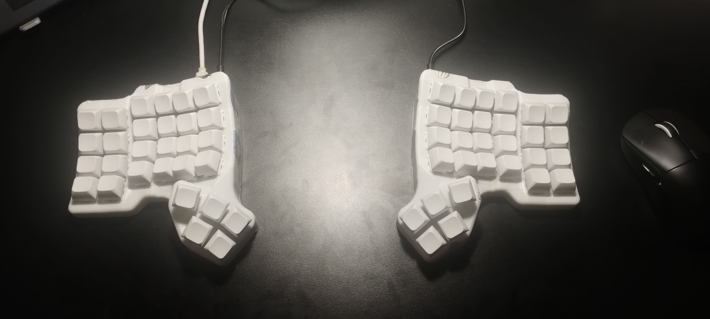

<!--
    Restructured GitHub Profile README for HoangGiap1804 - Light Theme
-->

<!-- Banner  -->

  <a href="https://api.github-star-counter.workers.dev/user/HoangGiap1804">
     
  </a>
  <a href="https://api.github-star-counter.workers.dev/user/HoangGiap1804">
     
  </a>
  

 

<!-- Who am i? -->

**Who Am I?**

I am a passionate **Software Developer** dedicated to building **efficient and elegant solutions**. My journey in technology is driven by **continuous learning** and a commitment to creating impactful software.

Currently, I am focusing on expanding my expertise in **modern web development** and **mobile applications**. I enjoy the intersection of **creative design and technical implementation**, ensuring every project I work on is both functional and visually appealing.

Feel free to explore my repositories and reach out if you'd like to collaborate!

 
 

<!-- badges -->

  <strong>Connect with me</strong>
   

  <!-- Pinterest -->
  
  <!-- Linkedin -->
  
  <!-- GMail  -->
  

 

> [!Caution]
>
> Code is never finished, it only gets **better**.

 

<!-- Contributions -->

  

 

<table align="center">
  <tr>
    <!-- Skills -->
    <td valign="top" width="50%">
      

        <strong>My Stack</strong>
          
         
         
         
         
      

    </td>
    <!-- Stats -->
    <td valign="top" width="50%">
      

        
      

    </td>
  </tr>
</table>
